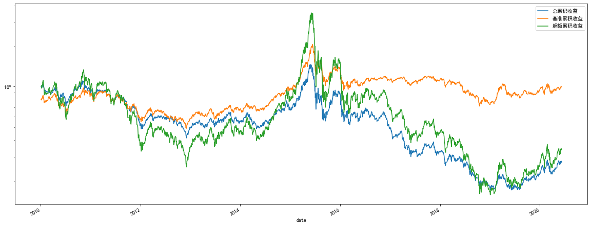
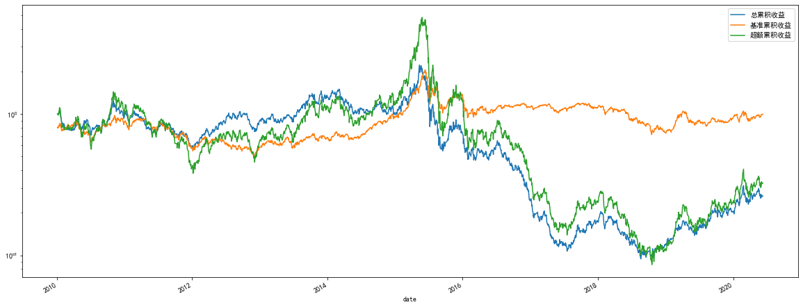

# Price-Volume Factor Backtesting Framework for a Share

Price-volume factor is an important kind of factor in alpha strategies for stocks. Normally, these kind of factors can be described as mathematical formulas, for example, delta(Close, 5)/delay(Close, 5), which means the pct_change of the close price in the past five days. We can use this way to generate a lot of price-volume factors.

## data

To compute factors, we need stock data about price and volume, such as open, high, low, close, volume, amount. I have prepared the data in the data folder.


```python
from factor.load_data import local_data
```


```python
local_data
```


    {'Amount': ticker            000001        000002      000004        000005  \
     date                                                               
     2010-01-04  5.802495e+08  1.034345e+09         0.0  1.334784e+08   
     2010-01-05  1.293477e+09  1.910014e+09         0.0  3.915752e+08   
     2010-01-06  9.444537e+08  1.405757e+09         0.0  3.051329e+08   
     2010-01-07  8.041663e+08  1.188788e+09         0.0  1.865434e+08   
     2010-01-08  6.506674e+08  1.117118e+09         0.0  9.824470e+07   
     ...                  ...           ...         ...           ...   
     2020-06-03  1.308782e+09  2.538105e+09  67171166.0  1.420082e+07   
     2020-06-04  7.887076e+08  1.927952e+09  74324762.0  1.676385e+07   
     2020-06-05  5.172321e+08  1.710520e+09  54038771.0  1.308916e+07   
     2020-06-08  8.021158e+08  1.887552e+09  37354117.0  7.847927e+06   
     2020-06-09  6.468958e+08  1.935525e+09  42632602.0  7.442675e+06   
     
     ticker            000006        000007      000008        000009       000010  \
     date                                                                            
     2010-01-04  7.054856e+07  1.810142e+07         0.0  1.894014e+08  22836715.00   
     2010-01-05  1.420314e+08  2.645200e+07         0.0  3.320040e+08  20520165.71   
     2010-01-06  1.500377e+08  3.152558e+07         0.0  2.466901e+08  17627535.51   
     2010-01-07  1.102372e+08  1.947653e+07         0.0  5.064841e+08  25100012.58   
     2010-01-08  9.751213e+07  1.081125e+07         0.0  6.105491e+08  12451285.66   
     ...                  ...           ...         ...           ...          ...   
     2020-06-03  1.535151e+08  1.070516e+08  45469967.0  2.905831e+08  24542414.00   
     2020-06-04  9.651072e+07  6.240574e+07  32776087.0  1.413979e+09  21250026.00   
     2020-06-05  6.036780e+07  1.053651e+08  38481692.0  6.877974e+08  24008462.00   
     2020-06-08  1.274315e+08  5.323644e+07  45896501.0  3.811993e+08  16992168.00   
     2020-06-09  7.147953e+07  2.067727e+07  26412455.0  3.983664e+08  12110236.00   
     
     ticker            000011  ...       603990      603991      603992  \
     date                      ...                                        
     2010-01-04  3.866746e+07  ...          NaN         NaN         NaN   
     2010-01-05  7.104669e+07  ...          NaN         NaN         NaN   
     2010-01-06  6.336060e+07  ...          NaN         NaN         NaN   
     2010-01-07  5.434457e+07  ...          NaN         NaN         NaN   
     2010-01-08  3.844200e+07  ...          NaN         NaN         NaN   
     ...                  ...  ...          ...         ...         ...   
     2020-06-03  3.720175e+08  ...  130000383.0  96673238.0  38630946.0   
     2020-06-04  3.636740e+08  ...   69720897.0  47570749.0  33299108.0   
     2020-06-05  1.705217e+08  ...  117326028.0  42310497.0  27151686.0   
     2020-06-08  1.616517e+08  ...  173715555.0  56304841.0  74852192.0   
     2020-06-09  1.380308e+08  ...   93284236.0  35450147.0  44666671.0   
     
     ticker            603993      603995      603996      603997      603998  \
     date                                                                       
     2010-01-04           NaN         NaN         NaN         NaN         NaN   
     2010-01-05           NaN         NaN         NaN         NaN         NaN   
     2010-01-06           NaN         NaN         NaN         NaN         NaN   
     2010-01-07           NaN         NaN         NaN         NaN         NaN   
     2010-01-08           NaN         NaN         NaN         NaN         NaN   
     ...                  ...         ...         ...         ...         ...   
     2020-06-03  2.595335e+08  68255313.0   4259401.0  93928889.0  40374010.0   
     2020-06-04  1.157819e+09  53796882.0   7647595.0  60664508.0  17954243.0   
     2020-06-05  5.011322e+08  58466313.0  11549708.0  48093039.0  14062859.0   
     2020-06-08  8.853670e+08  37841253.0   5541279.0  35611055.0  20374901.0   
     2020-06-09  4.868465e+08  39046874.0   4755129.0  74216142.0  19891960.0   
     
     ticker          603999       605001  
     date                                 
     2010-01-04         NaN          NaN  
     2010-01-05         NaN          NaN  
     2010-01-06         NaN          NaN  
     2010-01-07         NaN          NaN  
     2010-01-08         NaN          NaN  
     ...                ...          ...  
     2020-06-03  29205047.0          NaN  
     2020-06-04  94569629.0          NaN  
     2020-06-05  46087673.0  190034560.0  
     2020-06-08  68026948.0  142498289.0  
     2020-06-09  91471432.0  152400131.0  
     
     [2535 rows x 3794 columns],
     'BenchmarkIndexClose': date
     2020-06-09    5610.3774
     2020-06-08    5575.3036
     2020-06-05    5585.4231
     2020-06-04    5576.7535
     2020-06-03    5572.3125
                     ...    
     2010-01-08    4514.4520
     2010-01-07    4459.1550
     2010-01-06    4550.2790
     2010-01-05    4557.4750
     2010-01-04    4510.5270
     Name: close, Length: 2535, dtype: float64,
     'Close': ticker         000001     000002  000004  000005    000006    000007  \
     date                                                                   
     2010-01-04   7.671232   7.915429   10.00    5.99  3.444917  4.620008   
     2010-01-05   7.538579   7.736212   10.00    6.20  3.345782  4.793341   
     2010-01-06   7.409161   7.736212   10.00    6.08  3.355076  4.793341   
     2010-01-07   7.328275   7.676473   10.00    5.83  3.327195  4.653341   
     2010-01-08   7.312098   7.728744   10.00    5.89  3.407741  4.686674   
     ...               ...        ...     ...     ...       ...       ...   
     2020-06-03  13.540000  26.840000   29.10    2.64  5.140000  8.100000   
     2020-06-04  13.570000  26.730000   29.90    2.68  5.120000  8.120000   
     2020-06-05  13.590000  26.410000   29.24    2.66  5.080000  8.280000   
     2020-06-08  13.620000  26.600000   28.95    2.65  5.200000  8.080000   
     2020-06-09  13.670000  26.440000   28.58    2.64  5.080000  8.060000   
     
     ticker        000008    000009    000010     000011  ...  603990  603991  \
     date                                                 ...                   
     2010-01-04  1.387229  4.723155  2.952505   9.053516  ...     NaN     NaN   
     2010-01-05  1.387229  4.601155  2.900005   8.772720  ...     NaN     NaN   
     2010-01-06  1.387229  4.596798  2.930005   8.798247  ...     NaN     NaN   
     2010-01-07  1.387229  4.683941  2.815005   8.594033  ...     NaN     NaN   
     2010-01-08  1.387229  4.910513  2.865005   8.679122  ...     NaN     NaN   
     ...              ...       ...       ...        ...  ...     ...     ...   
     2020-06-03  3.020000  6.920000  3.930000  11.520000  ...   44.00   28.33   
     2020-06-04  3.000000  7.470000  3.930000  11.760000  ...   43.20   28.02   
     2020-06-05  3.000000  7.250000  4.080000  11.290000  ...   43.30   28.50   
     2020-06-08  3.000000  7.260000  4.070000  10.970000  ...   44.61   28.40   
     2020-06-09  2.990000  7.290000  4.120000  11.020000  ...   43.88   28.46   
     
     ticker      603992  603993  603995  603996  603997  603998  603999  605001  
     date                                                                        
     2010-01-04     NaN     NaN     NaN     NaN     NaN     NaN     NaN     NaN  
     2010-01-05     NaN     NaN     NaN     NaN     NaN     NaN     NaN     NaN  
     2010-01-06     NaN     NaN     NaN     NaN     NaN     NaN     NaN     NaN  
     2010-01-07     NaN     NaN     NaN     NaN     NaN     NaN     NaN     NaN  
     2010-01-08     NaN     NaN     NaN     NaN     NaN     NaN     NaN     NaN  
     ...            ...     ...     ...     ...     ...     ...     ...     ...  
     2020-06-03   16.48    3.50   23.76    2.26    7.12    6.55    5.80     NaN  
     2020-06-04   16.25    3.68   23.59    2.36    7.11    6.50    6.04     NaN  
     2020-06-05   16.29    3.61   23.84    2.30    7.07    6.50    5.95   22.73  
     2020-06-08   16.86    3.71   23.80    2.26    7.07    6.52    6.14   22.83  
     2020-06-09   16.84    3.72   23.78    2.29    6.90    6.49    6.31   22.39  
     
     [2535 rows x 3794 columns],
     'Csi300Weight': ticker       000001   000002  000004  000005  000006  000007  000008  000009  \
     date                                                                           
     2010-01-04  0.01300  0.01820     NaN     NaN     NaN     NaN     NaN  0.0021   
     2010-01-05  0.01270  0.01760     NaN     NaN     NaN     NaN     NaN  0.0020   
     2010-01-06  0.01260  0.01770     NaN     NaN     NaN     NaN     NaN  0.0020   
     2010-01-07  0.01270  0.01790     NaN     NaN     NaN     NaN     NaN  0.0021   
     2010-01-08  0.01260  0.01800     NaN     NaN     NaN     NaN     NaN  0.0022   
     ...             ...      ...     ...     ...     ...     ...     ...     ...   
     2020-06-03  0.00966  0.01148     NaN     NaN     NaN     NaN     NaN     NaN   
     2020-06-04  0.00966  0.01148     NaN     NaN     NaN     NaN     NaN     NaN   
     2020-06-05  0.00966  0.01148     NaN     NaN     NaN     NaN     NaN     NaN   
     2020-06-08  0.00966  0.01148     NaN     NaN     NaN     NaN     NaN     NaN   
     2020-06-09  0.00966  0.01148     NaN     NaN     NaN     NaN     NaN     NaN   
     
     ticker      000010  000011  ...  603990  603991  603992   603993  603995  \
     date                        ...                                            
     2010-01-04     NaN     NaN  ...     NaN     NaN     NaN      NaN     NaN   
     2010-01-05     NaN     NaN  ...     NaN     NaN     NaN      NaN     NaN   
     2010-01-06     NaN     NaN  ...     NaN     NaN     NaN      NaN     NaN   
     2010-01-07     NaN     NaN  ...     NaN     NaN     NaN      NaN     NaN   
     2010-01-08     NaN     NaN  ...     NaN     NaN     NaN      NaN     NaN   
     ...            ...     ...  ...     ...     ...     ...      ...     ...   
     2020-06-03     NaN     NaN  ...     NaN     NaN     NaN  0.00185     NaN   
     2020-06-04     NaN     NaN  ...     NaN     NaN     NaN  0.00185     NaN   
     2020-06-05     NaN     NaN  ...     NaN     NaN     NaN  0.00185     NaN   
     2020-06-08     NaN     NaN  ...     NaN     NaN     NaN  0.00185     NaN   
     2020-06-09     NaN     NaN  ...     NaN     NaN     NaN  0.00185     NaN   
     
     ticker      603996  603997  603998  603999  605001  
     date                                                
     2010-01-04     NaN     NaN     NaN     NaN     NaN  
     2010-01-05     NaN     NaN     NaN     NaN     NaN  
     2010-01-06     NaN     NaN     NaN     NaN     NaN  
     2010-01-07     NaN     NaN     NaN     NaN     NaN  
     2010-01-08     NaN     NaN     NaN     NaN     NaN  
     ...            ...     ...     ...     ...     ...  
     2020-06-03     NaN     NaN     NaN     NaN     NaN  
     2020-06-04     NaN     NaN     NaN     NaN     NaN  
     2020-06-05     NaN     NaN     NaN     NaN     NaN  
     2020-06-08     NaN     NaN     NaN     NaN     NaN  
     2020-06-09     NaN     NaN     NaN     NaN     NaN  
     
     [2535 rows x 3794 columns],
     'HaltStatus': ticker      000001  000002  000004  000005  000006  000007  000008  000009  \
     date                                                                         
     2010-01-04     0.0     0.0     1.0     0.0     0.0     0.0     1.0     0.0   
     2010-01-05     0.0     0.0     1.0     0.0     0.0     0.0     1.0     0.0   
     2010-01-06     0.0     0.0     1.0     0.0     0.0     0.0     1.0     0.0   
     2010-01-07     0.0     0.0     1.0     0.0     0.0     0.0     1.0     0.0   
     2010-01-08     0.0     0.0     1.0     0.0     0.0     0.0     1.0     0.0   
     ...            ...     ...     ...     ...     ...     ...     ...     ...   
     2020-06-03     0.0     0.0     0.0     0.0     0.0     0.0     0.0     0.0   
     2020-06-04     0.0     0.0     0.0     0.0     0.0     0.0     0.0     0.0   
     2020-06-05     0.0     0.0     0.0     0.0     0.0     0.0     0.0     0.0   
     2020-06-08     0.0     0.0     0.0     0.0     0.0     0.0     0.0     0.0   
     2020-06-09     0.0     0.0     0.0     0.0     0.0     0.0     0.0     0.0   
     
     ticker      000010  000011  ...  603990  603991  603992  603993  603995  \
     date                        ...                                           
     2010-01-04     0.0     0.0  ...     NaN     NaN     NaN     NaN     NaN   
     2010-01-05     0.0     0.0  ...     NaN     NaN     NaN     NaN     NaN   
     2010-01-06     0.0     0.0  ...     NaN     NaN     NaN     NaN     NaN   
     2010-01-07     0.0     0.0  ...     NaN     NaN     NaN     NaN     NaN   
     2010-01-08     0.0     0.0  ...     NaN     NaN     NaN     NaN     NaN   
     ...            ...     ...  ...     ...     ...     ...     ...     ...   
     2020-06-03     0.0     0.0  ...     0.0     0.0     0.0     0.0     0.0   
     2020-06-04     0.0     0.0  ...     0.0     0.0     0.0     0.0     0.0   
     2020-06-05     0.0     0.0  ...     0.0     0.0     0.0     0.0     0.0   
     2020-06-08     0.0     0.0  ...     0.0     0.0     0.0     0.0     0.0   
     2020-06-09     0.0     0.0  ...     0.0     0.0     0.0     0.0     0.0   
     
     ticker      603996  603997  603998  603999  605001  
     date                                                
     2010-01-04     NaN     NaN     NaN     NaN     NaN  
     2010-01-05     NaN     NaN     NaN     NaN     NaN  
     2010-01-06     NaN     NaN     NaN     NaN     NaN  
     2010-01-07     NaN     NaN     NaN     NaN     NaN  
     2010-01-08     NaN     NaN     NaN     NaN     NaN  
     ...            ...     ...     ...     ...     ...  
     2020-06-03     0.0     0.0     0.0     0.0     NaN  
     2020-06-04     0.0     0.0     0.0     0.0     NaN  
     2020-06-05     0.0     0.0     0.0     0.0     0.0  
     2020-06-08     0.0     0.0     0.0     0.0     0.0  
     2020-06-09     0.0     0.0     0.0     0.0     0.0  
     
     [2535 rows x 3794 columns],
     'High': ticker         000001     000002  000004  000005    000006    000007  \
     date                                                                   
     2010-01-04   7.952715   8.117048   10.00    6.05  3.516170  4.726675   
     2010-01-05   7.732705   7.855690   10.00    6.32  3.463504  4.793341   
     2010-01-06   7.522401   7.848222   10.00    6.28  3.420133  4.866675   
     2010-01-07   7.457692   7.788483   10.00    6.07  3.395350  4.826675   
     2010-01-08   7.360629   7.751146   10.00    5.93  3.407741  4.700008   
     ...               ...        ...     ...     ...       ...       ...   
     2020-06-03  13.880000  27.960000   29.96    2.67  5.260000  8.660000   
     2020-06-04  13.640000  27.130000   29.93    2.68  5.250000  8.230000   
     2020-06-05  13.620000  26.720000   29.81    2.69  5.180000  8.520000   
     2020-06-08  13.850000  26.850000   29.54    2.67  5.350000  8.280000   
     2020-06-09  13.730000  26.850000   28.95    2.66  5.180000  8.110000   
     
     ticker        000008    000009    000010     000011  ...  603990  603991  \
     date                                                 ...                   
     2010-01-04  1.387229  4.805941  3.020006   9.181150  ...     NaN     NaN   
     2010-01-05  1.387229  4.771084  2.962505   9.113078  ...     NaN     NaN   
     2010-01-06  1.387229  4.683941  2.932505   8.951408  ...     NaN     NaN   
     2010-01-07  1.387229  4.832084  2.942505   8.857810  ...     NaN     NaN   
     2010-01-08  1.387229  4.932298  2.865005   8.679122  ...     NaN     NaN   
     ...              ...       ...       ...        ...  ...     ...     ...   
     2020-06-03  3.030000  7.070000  3.970000  11.520000  ...   46.31   29.10   
     2020-06-04  3.030000  7.610000  4.100000  12.440000  ...   44.36   28.60   
     2020-06-05  3.010000  7.400000  4.080000  11.880000  ...   43.78   28.80   
     2020-06-08  3.010000  7.350000  4.120000  11.380000  ...   46.00   29.29   
     2020-06-09  3.010000  7.350000  4.120000  11.100000  ...   44.74   28.79   
     
     ticker      603992  603993  603995  603996  603997  603998  603999  605001  
     date                                                                        
     2010-01-04     NaN     NaN     NaN     NaN     NaN     NaN     NaN     NaN  
     2010-01-05     NaN     NaN     NaN     NaN     NaN     NaN     NaN     NaN  
     2010-01-06     NaN     NaN     NaN     NaN     NaN     NaN     NaN     NaN  
     2010-01-07     NaN     NaN     NaN     NaN     NaN     NaN     NaN     NaN  
     2010-01-08     NaN     NaN     NaN     NaN     NaN     NaN     NaN     NaN  
     ...            ...     ...     ...     ...     ...     ...     ...     ...  
     2020-06-03   16.73    3.54   24.22    2.29    7.25    6.77    5.89     NaN  
     2020-06-04   16.57    3.71   23.88    2.37    7.19    6.58    6.17     NaN  
     2020-06-05   16.34    3.67   24.07    2.34    7.12    6.53    6.05   23.40  
     2020-06-08   16.95    3.78   24.07    2.31    7.11    6.60    6.28   23.16  
     2020-06-09   16.90    3.77   23.90    2.33    7.19    6.55    6.37   22.77  
     
     [2535 rows x 3794 columns],
     'Ic500Weight': ticker      000001  000002  000004   000005   000006  000007   000008  \
     date                                                                    
     2010-01-04     NaN     NaN     NaN  0.00267  0.00279     NaN      NaN   
     2010-01-05     NaN     NaN     NaN  0.00267  0.00279     NaN      NaN   
     2010-01-06     NaN     NaN     NaN  0.00267  0.00279     NaN      NaN   
     2010-01-07     NaN     NaN     NaN  0.00267  0.00279     NaN      NaN   
     2010-01-08     NaN     NaN     NaN  0.00267  0.00279     NaN      NaN   
     ...            ...     ...     ...      ...      ...     ...      ...   
     2020-06-03     NaN     NaN     NaN      NaN  0.00103     NaN  0.00132   
     2020-06-04     NaN     NaN     NaN      NaN  0.00103     NaN  0.00132   
     2020-06-05     NaN     NaN     NaN      NaN  0.00103     NaN  0.00132   
     2020-06-08     NaN     NaN     NaN      NaN  0.00103     NaN  0.00132   
     2020-06-09     NaN     NaN     NaN      NaN  0.00103     NaN  0.00132   
     
     ticker       000009  000010  000011  ...  603990  603991  603992  603993  \
     date                                 ...                                   
     2010-01-04      NaN     NaN     NaN  ...     NaN     NaN     NaN     NaN   
     2010-01-05      NaN     NaN     NaN  ...     NaN     NaN     NaN     NaN   
     2010-01-06      NaN     NaN     NaN  ...     NaN     NaN     NaN     NaN   
     2010-01-07      NaN     NaN     NaN  ...     NaN     NaN     NaN     NaN   
     2010-01-08      NaN     NaN     NaN  ...     NaN     NaN     NaN     NaN   
     ...             ...     ...     ...  ...     ...     ...     ...     ...   
     2020-06-03  0.00403     NaN     NaN  ...     NaN     NaN     NaN     NaN   
     2020-06-04  0.00403     NaN     NaN  ...     NaN     NaN     NaN     NaN   
     2020-06-05  0.00403     NaN     NaN  ...     NaN     NaN     NaN     NaN   
     2020-06-08  0.00403     NaN     NaN  ...     NaN     NaN     NaN     NaN   
     2020-06-09  0.00403     NaN     NaN  ...     NaN     NaN     NaN     NaN   
     
     ticker      603995  603996  603997  603998  603999  605001  
     date                                                        
     2010-01-04     NaN     NaN     NaN     NaN     NaN     NaN  
     2010-01-05     NaN     NaN     NaN     NaN     NaN     NaN  
     2010-01-06     NaN     NaN     NaN     NaN     NaN     NaN  
     2010-01-07     NaN     NaN     NaN     NaN     NaN     NaN  
     2010-01-08     NaN     NaN     NaN     NaN     NaN     NaN  
     ...            ...     ...     ...     ...     ...     ...  
     2020-06-03     NaN     NaN     NaN     NaN     NaN     NaN  
     2020-06-04     NaN     NaN     NaN     NaN     NaN     NaN  
     2020-06-05     NaN     NaN     NaN     NaN     NaN     NaN  
     2020-06-08     NaN     NaN     NaN     NaN     NaN     NaN  
     2020-06-09     NaN     NaN     NaN     NaN     NaN     NaN  
     
     [2535 rows x 3794 columns],
     'Ih50Weight': ticker      000001  000002  000004  000005  000006  000007  000008  000009  \
     date                                                                         
     2010-01-04     NaN     NaN     NaN     NaN     NaN     NaN     NaN     NaN   
     2010-01-05     NaN     NaN     NaN     NaN     NaN     NaN     NaN     NaN   
     2010-01-06     NaN     NaN     NaN     NaN     NaN     NaN     NaN     NaN   
     2010-01-07     NaN     NaN     NaN     NaN     NaN     NaN     NaN     NaN   
     2010-01-08     NaN     NaN     NaN     NaN     NaN     NaN     NaN     NaN   
     ...            ...     ...     ...     ...     ...     ...     ...     ...   
     2020-06-03     NaN     NaN     NaN     NaN     NaN     NaN     NaN     NaN   
     2020-06-04     NaN     NaN     NaN     NaN     NaN     NaN     NaN     NaN   
     2020-06-05     NaN     NaN     NaN     NaN     NaN     NaN     NaN     NaN   
     2020-06-08     NaN     NaN     NaN     NaN     NaN     NaN     NaN     NaN   
     2020-06-09     NaN     NaN     NaN     NaN     NaN     NaN     NaN     NaN   
     
     ticker      000010  000011  ...  603990  603991  603992   603993  603995  \
     date                        ...                                            
     2010-01-04     NaN     NaN  ...     NaN     NaN     NaN      NaN     NaN   
     2010-01-05     NaN     NaN  ...     NaN     NaN     NaN      NaN     NaN   
     2010-01-06     NaN     NaN  ...     NaN     NaN     NaN      NaN     NaN   
     2010-01-07     NaN     NaN  ...     NaN     NaN     NaN      NaN     NaN   
     2010-01-08     NaN     NaN  ...     NaN     NaN     NaN      NaN     NaN   
     ...            ...     ...  ...     ...     ...     ...      ...     ...   
     2020-06-03     NaN     NaN  ...     NaN     NaN     NaN  0.00439     NaN   
     2020-06-04     NaN     NaN  ...     NaN     NaN     NaN  0.00439     NaN   
     2020-06-05     NaN     NaN  ...     NaN     NaN     NaN  0.00439     NaN   
     2020-06-08     NaN     NaN  ...     NaN     NaN     NaN  0.00439     NaN   
     2020-06-09     NaN     NaN  ...     NaN     NaN     NaN  0.00439     NaN   
     
     ticker      603996  603997  603998  603999  605001  
     date                                                
     2010-01-04     NaN     NaN     NaN     NaN     NaN  
     2010-01-05     NaN     NaN     NaN     NaN     NaN  
     2010-01-06     NaN     NaN     NaN     NaN     NaN  
     2010-01-07     NaN     NaN     NaN     NaN     NaN  
     2010-01-08     NaN     NaN     NaN     NaN     NaN  
     ...            ...     ...     ...     ...     ...  
     2020-06-03     NaN     NaN     NaN     NaN     NaN  
     2020-06-04     NaN     NaN     NaN     NaN     NaN  
     2020-06-05     NaN     NaN     NaN     NaN     NaN  
     2020-06-08     NaN     NaN     NaN     NaN     NaN  
     2020-06-09     NaN     NaN     NaN     NaN     NaN  
     
     [2535 rows x 3794 columns],
     'Low': ticker         000001     000002  000004  000005    000006    000007  \
     date                                                                   
     2010-01-04   7.661525   7.915429   10.00    5.91  3.441819  4.600008   
     2010-01-05   7.360629   7.616734   10.00    5.83  3.302411  4.553341   
     2010-01-06   7.350923   7.616734   10.00    6.06  3.320999  4.746675   
     2010-01-07   7.247389   7.646603   10.00    5.82  3.283824  4.613341   
     2010-01-08   7.231212   7.609266   10.00    5.74  3.299313  4.553341   
     ...               ...        ...     ...     ...       ...       ...   
     2020-06-03  13.500000  26.830000   28.93    2.63  4.960000  8.070000   
     2020-06-04  13.410000  26.310000   28.93    2.64  5.070000  7.890000   
     2020-06-05  13.430000  26.190000   29.00    2.64  5.050000  7.970000   
     2020-06-08  13.580000  26.420000   28.95    2.64  5.050000  8.010000   
     2020-06-09  13.530000  26.340000   28.40    2.61  5.080000  8.010000   
     
     ticker        000008    000009    000010     000011  ...  603990  603991  \
     date                                                 ...                   
     2010-01-04  1.387229  4.705726  2.947505   9.045007  ...     NaN     NaN   
     2010-01-05  1.387229  4.557583  2.880005   8.687631  ...     NaN     NaN   
     2010-01-06  1.387229  4.518369  2.887505   8.602542  ...     NaN     NaN   
     2010-01-07  1.387229  4.479154  2.782505   8.517452  ...     NaN     NaN   
     2010-01-08  1.387229  4.596798  2.757505   8.517452  ...     NaN     NaN   
     ...              ...       ...       ...        ...  ...     ...     ...   
     2020-06-03  3.000000  6.910000  3.790000  10.180000  ...   43.82   26.40   
     2020-06-04  2.990000  7.010000  3.880000  11.090000  ...   42.69   27.72   
     2020-06-05  2.970000  7.170000  3.950000  11.180000  ...   41.30   27.25   
     2020-06-08  2.980000  7.190000  4.030000  10.760000  ...   43.50   28.11   
     2020-06-09  2.980000  7.210000  4.020000  10.750000  ...   43.01   27.93   
     
     ticker      603992  603993  603995  603996  603997  603998  603999  605001  
     date                                                                        
     2010-01-04     NaN     NaN     NaN     NaN     NaN     NaN     NaN     NaN  
     2010-01-05     NaN     NaN     NaN     NaN     NaN     NaN     NaN     NaN  
     2010-01-06     NaN     NaN     NaN     NaN     NaN     NaN     NaN     NaN  
     2010-01-07     NaN     NaN     NaN     NaN     NaN     NaN     NaN     NaN  
     2010-01-08     NaN     NaN     NaN     NaN     NaN     NaN     NaN     NaN  
     ...            ...     ...     ...     ...     ...     ...     ...     ...  
     2020-06-03   16.41    3.49   23.70    2.23    6.98    6.53    5.78     NaN  
     2020-06-04   16.20    3.49   23.48    2.25    7.01    6.48    5.79     NaN  
     2020-06-05   16.03    3.58   23.60    2.24    7.00    6.46    5.91   22.62  
     2020-06-08   16.34    3.61   23.70    2.23    7.00    6.48    5.89   22.69  
     2020-06-09   16.56    3.67   23.61    2.23    6.89    6.46    6.02   22.35  
     
     [2535 rows x 3794 columns],
     'O1E1': ticker        000001    000002    000004    000005    000006    000007  \
     date                                                                     
     2010-01-04 -0.018947 -0.014272  0.000000  0.042017 -0.028777  0.036023   
     2010-01-05 -0.015054  0.000966  0.000000 -0.008157  0.003707  0.002789   
     2010-01-06 -0.010917 -0.007722  0.000000 -0.033167 -0.010138 -0.025140   
     2010-01-07  0.004444  0.006809  0.000000  0.015517  0.028037  0.012968   
     2010-01-08 -0.038298 -0.032319  0.000000 -0.013559 -0.042039  0.004261   
     ...              ...       ...       ...       ...       ...       ...   
     2020-06-03  0.002956 -0.010733  0.031034  0.011321  0.003922  0.002469   
     2020-06-04 -0.000735 -0.009006 -0.018133 -0.007463 -0.003922  0.017199   
     2020-06-05 -0.004386  0.000376 -0.009918 -0.003759  0.017613 -0.022975   
     2020-06-08  0.002199 -0.006015 -0.011415 -0.003774 -0.019305 -0.006165   
     2020-06-09       NaN       NaN       NaN       NaN       NaN       NaN   
     
     ticker        000008    000009    000010    000011  ...    603990    603991  \
     date                                                ...                       
     2010-01-04  0.000000 -0.030303 -0.017782 -0.027358  ...       NaN       NaN   
     2010-01-05  0.000000 -0.000947  0.009475  0.006816  ...       NaN       NaN   
     2010-01-06  0.000000  0.029693 -0.040068 -0.007859  ...       NaN       NaN   
     2010-01-07  0.000000  0.053271  0.027803  0.018981  ...       NaN       NaN   
     2010-01-08  0.000000 -0.027289 -0.011986  0.021463  ...       NaN       NaN   
     ...              ...       ...       ...       ...  ...       ...       ...   
     2020-06-03 -0.009901  0.065621  0.012887  0.037952  ... -0.017065 -0.006383   
     2020-06-04  0.000000 -0.016282  0.025126 -0.043220  ...  0.004640  0.010638   
     2020-06-05  0.000000 -0.008197 -0.002451 -0.033480  ...  0.011565 -0.012861   
     2020-06-08 -0.006645 -0.002736  0.014778  0.001818  ... -0.008810  0.002113   
     2020-06-09       NaN       NaN       NaN       NaN  ...       NaN       NaN   
     
     ticker        603992    603993    603995    603996    603997    603998  \
     date                                                                     
     2010-01-04       NaN       NaN       NaN       NaN       NaN       NaN   
     2010-01-05       NaN       NaN       NaN       NaN       NaN       NaN   
     2010-01-06       NaN       NaN       NaN       NaN       NaN       NaN   
     2010-01-07       NaN       NaN       NaN       NaN       NaN       NaN   
     2010-01-08       NaN       NaN       NaN       NaN       NaN       NaN   
     ...              ...       ...       ...       ...       ...       ...   
     2020-06-03 -0.019312  0.045455 -0.007155  0.048889 -0.002805 -0.007634   
     2020-06-04  0.001229 -0.013661  0.008034  0.026786 -0.007022  0.000000   
     2020-06-05  0.031824  0.022039 -0.006678 -0.008772  0.000000  0.003077   
     2020-06-08  0.002381  0.000000  0.000000  0.026906 -0.026798 -0.006126   
     2020-06-09       NaN       NaN       NaN       NaN       NaN       NaN   
     
     ticker        603999    605001  
     date                            
     2010-01-04       NaN       NaN  
     2010-01-05       NaN       NaN  
     2010-01-06       NaN       NaN  
     2010-01-07       NaN       NaN  
     2010-01-08       NaN       NaN  
     ...              ...       ...  
     2020-06-03  0.037801       NaN  
     2020-06-04 -0.008333       NaN  
     2020-06-05  0.033670  0.003076  
     2020-06-08  0.031046 -0.014091  
     2020-06-09       NaN       NaN  
     
     [2535 rows x 3794 columns],
     'O1E2': ticker        000001    000002    000004    000005    000006    000007  \
     date                                                                     
     2010-01-04 -0.035789 -0.014272  0.000000  0.021849 -0.026079  0.036023   
     2010-01-05 -0.025806 -0.006763  0.000000 -0.048940 -0.004634 -0.026499   
     2010-01-06 -0.013100 -0.000965  0.000000 -0.023217  0.013825 -0.018156   
     2010-01-07  0.004444 -0.009728  0.000000  0.003448  0.000935  0.018732   
     2010-01-08 -0.044681 -0.021863  0.000000  0.038983  0.000000  0.015625   
     ...              ...       ...       ...       ...       ...       ...   
     2020-06-03  0.004435 -0.022576  0.008276  0.003774 -0.003922  0.022222   
     2020-06-04  0.001471 -0.001876 -0.027871 -0.011194  0.019608 -0.007371   
     2020-06-05 -0.000731 -0.005641 -0.022572 -0.007519 -0.005871 -0.025393   
     2020-06-08       NaN       NaN       NaN       NaN       NaN       NaN   
     2020-06-09       NaN       NaN       NaN       NaN       NaN       NaN   
     
     ticker        000008    000009    000010    000011  ...    603990    603991  \
     date                                                ...                       
     2010-01-04  0.000000 -0.031221 -0.007621 -0.024528  ...       NaN       NaN   
     2010-01-05  0.000000  0.017992 -0.030146 -0.016553  ...       NaN       NaN   
     2010-01-06  0.000000  0.079502 -0.023018  0.001965  ...       NaN       NaN   
     2010-01-07  0.000000  0.032710  0.034978  0.045954  ...       NaN       NaN   
     2010-01-08  0.000000 -0.002641  0.017123  0.044878  ...       NaN       NaN   
     ...              ...       ...       ...       ...  ...       ...       ...   
     2020-06-03 -0.009901  0.034237  0.051546 -0.003530  ... -0.014790  0.010638   
     2020-06-04  0.000000 -0.014925  0.022613 -0.070339  ...  0.035035  0.007092   
     2020-06-05 -0.003333 -0.004098  0.009804 -0.029075  ... -0.004989 -0.010775   
     2020-06-08       NaN       NaN       NaN       NaN  ...       NaN       NaN   
     2020-06-09       NaN       NaN       NaN       NaN  ...       NaN       NaN   
     
     ticker        603992    603993    603995    603996    603997    603998  \
     date                                                                     
     2010-01-04       NaN       NaN       NaN       NaN       NaN       NaN   
     2010-01-05       NaN       NaN       NaN       NaN       NaN       NaN   
     2010-01-06       NaN       NaN       NaN       NaN       NaN       NaN   
     2010-01-07       NaN       NaN       NaN       NaN       NaN       NaN   
     2010-01-08       NaN       NaN       NaN       NaN       NaN       NaN   
     ...              ...       ...       ...       ...       ...       ...   
     2020-06-03 -0.016898  0.025568  0.003367  0.022222 -0.008415 -0.007634   
     2020-06-04  0.036263  0.013661  0.006342  0.008929 -0.007022  0.003077   
     2020-06-05  0.030600  0.024793 -0.007513  0.004386 -0.024045 -0.001538   
     2020-06-08       NaN       NaN       NaN       NaN       NaN       NaN   
     2020-06-09       NaN       NaN       NaN       NaN       NaN       NaN   
     
     ticker        603999    605001  
     date                            
     2010-01-04       NaN       NaN  
     2010-01-05       NaN       NaN  
     2010-01-06       NaN       NaN  
     2010-01-07       NaN       NaN  
     2010-01-08       NaN       NaN  
     ...              ...       ...  
     2020-06-03  0.022337       NaN  
     2020-06-04  0.023333       NaN  
     2020-06-05  0.062290 -0.016257  
     2020-06-08       NaN       NaN  
     2020-06-09       NaN       NaN  
     
     [2535 rows x 3794 columns],
     'O1E3': ticker        000001    000002    000004    000005    000006    000007  \
     date                                                                     
     2010-01-04 -0.046316 -0.021884  0.000000 -0.020168 -0.034173  0.005764   
     2010-01-05 -0.027957  0.000000  0.000000 -0.039152  0.019462 -0.019526   
     2010-01-06 -0.013100 -0.017375  0.000000 -0.034826 -0.012903 -0.012570   
     2010-01-07 -0.002222  0.000973  0.000000  0.056897  0.044860  0.030259   
     2010-01-08 -0.108085 -0.045627  0.000000  0.023729 -0.032200 -0.011364   
     ...              ...       ...       ...       ...       ...       ...   
     2020-06-03  0.006652 -0.015544 -0.001724  0.000000  0.019608 -0.002469   
     2020-06-04  0.005147 -0.007880 -0.040296 -0.014925 -0.003922 -0.009828   
     2020-06-05       NaN       NaN       NaN       NaN       NaN       NaN   
     2020-06-08       NaN       NaN       NaN       NaN       NaN       NaN   
     2020-06-09       NaN       NaN       NaN       NaN       NaN       NaN   
     
     ticker        000008    000009    000010    000011  ...    603990    603991  \
     date                                                ...                       
     2010-01-04  0.000000 -0.012856 -0.046571 -0.047170  ...       NaN       NaN   
     2010-01-05  0.000000  0.067235 -0.012920 -0.006816  ...       NaN       NaN   
     2010-01-06  0.000000  0.058429 -0.016198  0.028487  ...       NaN       NaN   
     2010-01-07  0.000000  0.058879  0.065471  0.069930  ...       NaN       NaN   
     2010-01-08  0.000000 -0.055458  0.009418 -0.009756  ...       NaN       NaN   
     ...              ...       ...       ...       ...  ...       ...       ...   
     2020-06-03 -0.009901  0.035663  0.048969 -0.031774  ...  0.015017  0.007092   
     2020-06-04 -0.003333 -0.010855  0.035176 -0.066102  ...  0.018097  0.009220   
     2020-06-05       NaN       NaN       NaN       NaN  ...       NaN       NaN   
     2020-06-08       NaN       NaN       NaN       NaN  ...       NaN       NaN   
     2020-06-09       NaN       NaN       NaN       NaN  ...       NaN       NaN   
     
     ticker        603992    603993    603995    603996    603997    603998  \
     date                                                                     
     2010-01-04       NaN       NaN       NaN       NaN       NaN       NaN   
     2010-01-05       NaN       NaN       NaN       NaN       NaN       NaN   
     2010-01-06       NaN       NaN       NaN       NaN       NaN       NaN   
     2010-01-07       NaN       NaN       NaN       NaN       NaN       NaN   
     2010-01-08       NaN       NaN       NaN       NaN       NaN       NaN   
     ...              ...       ...       ...       ...       ...       ...   
     2020-06-03  0.017502  0.053977  0.001684  0.004444 -0.008415 -0.004580   
     2020-06-04  0.035034  0.016393  0.005497  0.022321 -0.030899 -0.001538   
     2020-06-05       NaN       NaN       NaN       NaN       NaN       NaN   
     2020-06-08       NaN       NaN       NaN       NaN       NaN       NaN   
     2020-06-09       NaN       NaN       NaN       NaN       NaN       NaN   
     
     ticker        603999  605001  
     date                          
     2010-01-04       NaN     NaN  
     2010-01-05       NaN     NaN  
     2010-01-06       NaN     NaN  
     2010-01-07       NaN     NaN  
     2010-01-08       NaN     NaN  
     ...              ...     ...  
     2020-06-03  0.054983     NaN  
     2020-06-04  0.051667     NaN  
     2020-06-05       NaN     NaN  
     2020-06-08       NaN     NaN  
     2020-06-09       NaN     NaN  
     
     [2535 rows x 3794 columns],
     'O1O2': ticker        000001    000002    000004    000005    000006    000007  \
     date                                                                     
     2010-01-04  0.012209  0.014697  0.035746  0.000000  0.005372  0.012218   
     2010-01-05  0.002220 -0.040156 -0.011504 -0.009032 -0.007407 -0.020729   
     2010-01-06 -0.058693 -0.033479 -0.045486 -0.027727 -0.026866 -0.027102   
     2010-01-07  0.014275  0.018072  0.011797 -0.041608  0.029371 -0.005282   
     2010-01-08  0.010526 -0.011553  0.022001  0.001316 -0.019091  0.014068   
     ...              ...       ...       ...       ...       ...       ...   
     2020-06-03 -0.011142  0.018868 -0.007299  0.029915  0.020888 -0.024293   
     2020-06-04 -0.008451  0.002058  0.053922 -0.004979 -0.002558 -0.009346   
     2020-06-05 -0.039289  0.011636  0.005833 -0.015192  0.006716 -0.026667   
     2020-06-08       NaN       NaN       NaN       NaN       NaN       NaN   
     2020-06-09       NaN       NaN       NaN       NaN       NaN       NaN   
     
     ticker        000008    000009    000010    000011  ...    603990    603991  \
     date                                                ...                       
     2010-01-04  0.010122 -0.029771  0.003518  0.052156  ...       NaN       NaN   
     2010-01-05 -0.044259  0.002685 -0.008125  0.003966  ...       NaN       NaN   
     2010-01-06  0.017148 -0.022758  0.000000 -0.034043  ...       NaN       NaN   
     2010-01-07  0.011813  0.107692  0.000000  0.039459  ...       NaN       NaN   
     2010-01-08 -0.005897 -0.078993  0.006791  0.087051  ...       NaN       NaN   
     ...              ...       ...       ...       ...  ...       ...       ...   
     2020-06-03  0.010356  0.001689 -0.005797  0.024752  ... -0.002506  0.106195   
     2020-06-04  0.015552  0.018550  0.011662 -0.004831  ... -0.002513 -0.134367   
     2020-06-05 -0.011745 -0.015660  0.000000 -0.023490  ... -0.006262  0.008989   
     2020-06-08       NaN       NaN       NaN       NaN  ...       NaN       NaN   
     2020-06-09       NaN       NaN       NaN       NaN  ...       NaN       NaN   
     
     ticker        603992    603993    603995    603996    603997    603998  \
     date                                                                     
     2010-01-04       NaN       NaN       NaN       NaN       NaN       NaN   
     2010-01-05       NaN       NaN       NaN       NaN       NaN       NaN   
     2010-01-06       NaN       NaN       NaN       NaN       NaN       NaN   
     2010-01-07       NaN       NaN       NaN       NaN       NaN       NaN   
     2010-01-08       NaN       NaN       NaN       NaN       NaN       NaN   
     ...              ...       ...       ...       ...       ...       ...   
     2020-06-03  0.001227  0.038896 -0.038554  0.000000 -0.003484  0.006696   
     2020-06-04  0.001225  0.027174  0.007519 -0.003503  0.026224  0.001531   
     2020-06-05  0.002538  0.002123 -0.003690  0.006369 -0.088455 -0.017778   
     2020-06-08       NaN       NaN       NaN       NaN       NaN       NaN   
     2020-06-09       NaN       NaN       NaN       NaN       NaN       NaN   
     
     ticker        603999    605001  
     date                            
     2010-01-04       NaN       NaN  
     2010-01-05       NaN       NaN  
     2010-01-06       NaN       NaN  
     2010-01-07       NaN       NaN  
     2010-01-08       NaN       NaN  
     ...              ...       ...  
     2020-06-03  0.008116       NaN  
     2020-06-04  0.039320       NaN  
     2020-06-05  0.007345 -0.009191  
     2020-06-08       NaN       NaN  
     2020-06-09       NaN       NaN  
     
     [2535 rows x 3794 columns],
     'Open': ticker         000001     000002  000004  000005    000006    000007  \
     date                                                                   
     2010-01-04   7.933302   8.102114   10.00    6.01  3.509974  4.726675   
     2010-01-05   7.684173   7.848222   10.00    5.95  3.444917  4.626674   
     2010-01-06   7.522401   7.728744   10.00    6.13  3.342685  4.780008   
     2010-01-07   7.409161   7.736212   10.00    6.03  3.361272  4.773341   
     2010-01-08   7.279743   7.676473   10.00    5.80  3.314803  4.626674   
     ...               ...        ...     ...     ...       ...       ...   
     2020-06-03  13.640000  27.400000   29.29    2.66  5.000000  8.660000   
     2020-06-04  13.530000  27.020000   29.00    2.65  5.100000  8.100000   
     2020-06-05  13.600000  26.650000   29.78    2.68  5.100000  8.140000   
     2020-06-08  13.680000  26.590000   29.24    2.66  5.110000  8.270000   
     2020-06-09  13.640000  26.600000   28.91    2.65  5.180000  8.110000   
     
     ticker        000008    000009    000010     000011  ...  603990  603991  \
     date                                                 ...                   
     2010-01-04  1.387229  4.792870  2.987506   9.181150  ...     NaN     NaN   
     2010-01-05  1.387229  4.744941  2.952505   9.019480  ...     NaN     NaN   
     2010-01-06  1.387229  4.601155  2.902505   8.738685  ...     NaN     NaN   
     2010-01-07  1.387229  4.548869  2.932505   8.662104  ...     NaN     NaN   
     2010-01-08  1.387229  4.662155  2.787505   8.517452  ...     NaN     NaN   
     ...              ...       ...       ...        ...  ...     ...     ...   
     2020-06-03  3.020000  7.030000  3.890000  10.280000  ...   46.31   27.00   
     2020-06-04  3.030000  7.010000  3.880000  11.330000  ...   43.95   28.20   
     2020-06-05  3.000000  7.370000  3.980000  11.800000  ...   43.10   28.20   
     2020-06-08  3.000000  7.320000  4.080000  11.350000  ...   44.10   28.77   
     2020-06-09  3.010000  7.310000  4.060000  11.000000  ...   44.27   28.40   
     
     ticker      603992  603993  603995  603996  603997  603998  603999  605001  
     date                                                                        
     2010-01-04     NaN     NaN     NaN     NaN     NaN     NaN     NaN     NaN  
     2010-01-05     NaN     NaN     NaN     NaN     NaN     NaN     NaN     NaN  
     2010-01-06     NaN     NaN     NaN     NaN     NaN     NaN     NaN     NaN  
     2010-01-07     NaN     NaN     NaN     NaN     NaN     NaN     NaN     NaN  
     2010-01-08     NaN     NaN     NaN     NaN     NaN     NaN     NaN     NaN  
     ...            ...     ...     ...     ...     ...     ...     ...     ...  
     2020-06-03   16.50    3.53   23.93    2.25    7.03    6.56    5.84     NaN  
     2020-06-04   16.57    3.52   23.76    2.25    7.13    6.55    5.82     NaN  
     2020-06-05   16.27    3.66   23.65    2.24    7.12    6.50    6.00   23.02  
     2020-06-08   16.34    3.63   23.96    2.28    7.07    6.50    5.94   22.76  
     2020-06-09   16.80    3.72   23.78    2.23    7.09    6.53    6.12   22.71  
     
     [2535 rows x 3794 columns],
     'StStatus': ticker      000001  000002  000004  000005  000006  000007  000008  000009  \
     date                                                                         
     2010-01-04     0.0     0.0     1.0     0.0     0.0     1.0     1.0     0.0   
     2010-01-05     0.0     0.0     1.0     0.0     0.0     1.0     1.0     0.0   
     2010-01-06     0.0     0.0     1.0     0.0     0.0     1.0     1.0     0.0   
     2010-01-07     0.0     0.0     1.0     0.0     0.0     1.0     1.0     0.0   
     2010-01-08     0.0     0.0     1.0     0.0     0.0     1.0     1.0     0.0   
     ...            ...     ...     ...     ...     ...     ...     ...     ...   
     2020-06-03     0.0     0.0     0.0     0.0     0.0     0.0     0.0     0.0   
     2020-06-04     0.0     0.0     0.0     0.0     0.0     0.0     0.0     0.0   
     2020-06-05     0.0     0.0     0.0     0.0     0.0     0.0     0.0     0.0   
     2020-06-08     0.0     0.0     0.0     0.0     0.0     0.0     0.0     0.0   
     2020-06-09     0.0     0.0     0.0     0.0     0.0     0.0     0.0     0.0   
     
     ticker      000010  000011  ...  603990  603991  603992  603993  603995  \
     date                        ...                                           
     2010-01-04     1.0     0.0  ...     NaN     NaN     NaN     NaN     NaN   
     2010-01-05     1.0     0.0  ...     NaN     NaN     NaN     NaN     NaN   
     2010-01-06     1.0     0.0  ...     NaN     NaN     NaN     NaN     NaN   
     2010-01-07     1.0     0.0  ...     NaN     NaN     NaN     NaN     NaN   
     2010-01-08     1.0     0.0  ...     NaN     NaN     NaN     NaN     NaN   
     ...            ...     ...  ...     ...     ...     ...     ...     ...   
     2020-06-03     1.0     0.0  ...     0.0     0.0     0.0     0.0     0.0   
     2020-06-04     1.0     0.0  ...     0.0     0.0     0.0     0.0     0.0   
     2020-06-05     1.0     0.0  ...     0.0     0.0     0.0     0.0     0.0   
     2020-06-08     1.0     0.0  ...     0.0     0.0     0.0     0.0     0.0   
     2020-06-09     1.0     0.0  ...     0.0     0.0     0.0     0.0     0.0   
     
     ticker      603996  603997  603998  603999  605001  
     date                                                
     2010-01-04     NaN     NaN     NaN     NaN     NaN  
     2010-01-05     NaN     NaN     NaN     NaN     NaN  
     2010-01-06     NaN     NaN     NaN     NaN     NaN  
     2010-01-07     NaN     NaN     NaN     NaN     NaN  
     2010-01-08     NaN     NaN     NaN     NaN     NaN  
     ...            ...     ...     ...     ...     ...  
     2020-06-03     1.0     0.0     0.0     0.0     NaN  
     2020-06-04     1.0     0.0     0.0     0.0     NaN  
     2020-06-05     1.0     0.0     0.0     0.0     0.0  
     2020-06-08     1.0     0.0     0.0     0.0     0.0  
     2020-06-09     1.0     0.0     0.0     0.0     0.0  
     
     [2535 rows x 3794 columns],
     'Volume': ticker          000001       000002     000004      000005      000006  \
     date                                                                     
     2010-01-04  24192276.0   96983253.0        0.0  22358222.0   6299805.0   
     2010-01-05  55649982.0  184862078.0        0.0  64425242.0  13129946.0   
     2010-01-06  41214313.0  135860406.0        0.0  49403408.0  13836030.0   
     2010-01-07  35533685.0  115244198.0        0.0  31441723.0  10224620.0   
     2010-01-08  28854306.0  108530422.0        0.0  16789249.0   8975737.0   
     ...                ...          ...        ...         ...         ...   
     2020-06-03  95680308.0   92749214.0  2281046.0   5373431.0  30183108.0   
     2020-06-04  58306633.0   72455579.0  2520133.0   6284926.0  18669317.0   
     2020-06-05  38302690.0   64940073.0  1843600.0   4914200.0  11867878.0   
     2020-06-08  58597190.0   70904066.0  1282900.0   2961123.0  24555628.0   
     2020-06-09  47430007.0   73099449.0  1493600.0   2828982.0  13994715.0   
     
     ticker          000007      000008       000009     000010      000011  ...  \
     date                                                                    ...   
     2010-01-04   2590179.0         0.0   17362671.0  1920679.0   3625940.0  ...   
     2010-01-05   3780937.0         0.0   31463320.0  1762319.0   6865389.0  ...   
     2010-01-06   4360825.0         0.0   23408440.0  1515349.0   6138902.0  ...   
     2010-01-07   2744108.0         0.0   47286323.0  2203319.0   5344953.0  ...   
     2010-01-08   1554091.0         0.0   55376908.0  1101912.0   3795357.0  ...   
     ...                ...         ...          ...        ...         ...  ...   
     2020-06-03  13015139.0  15066718.0   41648002.0  6353991.0  34083546.0  ...   
     2020-06-04   7723217.0  10912844.0  190035234.0  5352278.0  31003819.0  ...   
     2020-06-05  12792188.0  12865931.0   94908219.0  5942574.0  14907500.0  ...   
     2020-06-08   6586962.0  15314496.0   52530829.0  4164406.0  14671162.0  ...   
     2020-06-09   2571901.0   8831809.0   54698341.0  2969217.0  12627193.0  ...   
     
     ticker         603990     603991     603992       603993     603995  \
     date                                                                  
     2010-01-04        NaN        NaN        NaN          NaN        NaN   
     2010-01-05        NaN        NaN        NaN          NaN        NaN   
     2010-01-06        NaN        NaN        NaN          NaN        NaN   
     2010-01-07        NaN        NaN        NaN          NaN        NaN   
     2010-01-08        NaN        NaN        NaN          NaN        NaN   
     ...               ...        ...        ...          ...        ...   
     2020-06-03  2926140.0  3432300.0  2338100.0   73879559.0  2854390.0   
     2020-06-04  1616532.0  1699300.0  2041746.0  319555837.0  2278113.0   
     2020-06-05  2761999.0  1503700.0  1680407.0  138938015.0  2444946.0   
     2020-06-08  3878340.0  1965100.0  4483507.0  238306331.0  1587690.0   
     2020-06-09  2135088.0  1250100.0  2669987.0  131064568.0  1644701.0   
     
     ticker         603996      603997     603998      603999     605001  
     date                                                                 
     2010-01-04        NaN         NaN        NaN         NaN        NaN  
     2010-01-05        NaN         NaN        NaN         NaN        NaN  
     2010-01-06        NaN         NaN        NaN         NaN        NaN  
     2010-01-07        NaN         NaN        NaN         NaN        NaN  
     2010-01-08        NaN         NaN        NaN         NaN        NaN  
     ...               ...         ...        ...         ...        ...  
     2020-06-03  1881100.0  13225787.0  6082688.0   5007200.0        NaN  
     2020-06-04  3285601.0   8564801.0  2759000.0  15702820.0        NaN  
     2020-06-05  5073401.0   6824537.0  2166700.0   7716760.0  8285424.0  
     2020-06-08  2440450.0   5055314.0  3122800.0  11198904.0  6222635.0  
     2020-06-09  2075300.0  10603591.0  3060200.0  14719318.0  6776349.0  
     
     [2535 rows x 3794 columns]}


```python
local_data['Open']
```


<div>
<style scoped>
    .dataframe tbody tr th:only-of-type {
        vertical-align: middle;
    }

    .dataframe tbody tr th {
        vertical-align: top;
    }

    .dataframe thead th {
        text-align: right;
    }
</style>
<table border="1" class="dataframe">
  <thead>
    <tr style="text-align: right;">
      <th>ticker</th>
      <th>000001</th>
      <th>000002</th>
      <th>000004</th>
      <th>000005</th>
      <th>000006</th>
      <th>000007</th>
      <th>000008</th>
      <th>000009</th>
      <th>000010</th>
      <th>000011</th>
      <th>...</th>
      <th>603990</th>
      <th>603991</th>
      <th>603992</th>
      <th>603993</th>
      <th>603995</th>
      <th>603996</th>
      <th>603997</th>
      <th>603998</th>
      <th>603999</th>
      <th>605001</th>
    </tr>
    <tr>
      <th>date</th>
      <th></th>
      <th></th>
      <th></th>
      <th></th>
      <th></th>
      <th></th>
      <th></th>
      <th></th>
      <th></th>
      <th></th>
      <th></th>
      <th></th>
      <th></th>
      <th></th>
      <th></th>
      <th></th>
      <th></th>
      <th></th>
      <th></th>
      <th></th>
      <th></th>
    </tr>
  </thead>
  <tbody>
    <tr>
      <th>2010-01-04</th>
      <td>7.933302</td>
      <td>8.102114</td>
      <td>10.00</td>
      <td>6.01</td>
      <td>3.509974</td>
      <td>4.726675</td>
      <td>1.387229</td>
      <td>4.792870</td>
      <td>2.987506</td>
      <td>9.181150</td>
      <td>...</td>
      <td>NaN</td>
      <td>NaN</td>
      <td>NaN</td>
      <td>NaN</td>
      <td>NaN</td>
      <td>NaN</td>
      <td>NaN</td>
      <td>NaN</td>
      <td>NaN</td>
      <td>NaN</td>
    </tr>
    <tr>
      <th>2010-01-05</th>
      <td>7.684173</td>
      <td>7.848222</td>
      <td>10.00</td>
      <td>5.95</td>
      <td>3.444917</td>
      <td>4.626674</td>
      <td>1.387229</td>
      <td>4.744941</td>
      <td>2.952505</td>
      <td>9.019480</td>
      <td>...</td>
      <td>NaN</td>
      <td>NaN</td>
      <td>NaN</td>
      <td>NaN</td>
      <td>NaN</td>
      <td>NaN</td>
      <td>NaN</td>
      <td>NaN</td>
      <td>NaN</td>
      <td>NaN</td>
    </tr>
    <tr>
      <th>2010-01-06</th>
      <td>7.522401</td>
      <td>7.728744</td>
      <td>10.00</td>
      <td>6.13</td>
      <td>3.342685</td>
      <td>4.780008</td>
      <td>1.387229</td>
      <td>4.601155</td>
      <td>2.902505</td>
      <td>8.738685</td>
      <td>...</td>
      <td>NaN</td>
      <td>NaN</td>
      <td>NaN</td>
      <td>NaN</td>
      <td>NaN</td>
      <td>NaN</td>
      <td>NaN</td>
      <td>NaN</td>
      <td>NaN</td>
      <td>NaN</td>
    </tr>
    <tr>
      <th>2010-01-07</th>
      <td>7.409161</td>
      <td>7.736212</td>
      <td>10.00</td>
      <td>6.03</td>
      <td>3.361272</td>
      <td>4.773341</td>
      <td>1.387229</td>
      <td>4.548869</td>
      <td>2.932505</td>
      <td>8.662104</td>
      <td>...</td>
      <td>NaN</td>
      <td>NaN</td>
      <td>NaN</td>
      <td>NaN</td>
      <td>NaN</td>
      <td>NaN</td>
      <td>NaN</td>
      <td>NaN</td>
      <td>NaN</td>
      <td>NaN</td>
    </tr>
    <tr>
      <th>2010-01-08</th>
      <td>7.279743</td>
      <td>7.676473</td>
      <td>10.00</td>
      <td>5.80</td>
      <td>3.314803</td>
      <td>4.626674</td>
      <td>1.387229</td>
      <td>4.662155</td>
      <td>2.787505</td>
      <td>8.517452</td>
      <td>...</td>
      <td>NaN</td>
      <td>NaN</td>
      <td>NaN</td>
      <td>NaN</td>
      <td>NaN</td>
      <td>NaN</td>
      <td>NaN</td>
      <td>NaN</td>
      <td>NaN</td>
      <td>NaN</td>
    </tr>
    <tr>
      <th>...</th>
      <td>...</td>
      <td>...</td>
      <td>...</td>
      <td>...</td>
      <td>...</td>
      <td>...</td>
      <td>...</td>
      <td>...</td>
      <td>...</td>
      <td>...</td>
      <td>...</td>
      <td>...</td>
      <td>...</td>
      <td>...</td>
      <td>...</td>
      <td>...</td>
      <td>...</td>
      <td>...</td>
      <td>...</td>
      <td>...</td>
      <td>...</td>
    </tr>
    <tr>
      <th>2020-06-03</th>
      <td>13.640000</td>
      <td>27.400000</td>
      <td>29.29</td>
      <td>2.66</td>
      <td>5.000000</td>
      <td>8.660000</td>
      <td>3.020000</td>
      <td>7.030000</td>
      <td>3.890000</td>
      <td>10.280000</td>
      <td>...</td>
      <td>46.31</td>
      <td>27.00</td>
      <td>16.50</td>
      <td>3.53</td>
      <td>23.93</td>
      <td>2.25</td>
      <td>7.03</td>
      <td>6.56</td>
      <td>5.84</td>
      <td>NaN</td>
    </tr>
    <tr>
      <th>2020-06-04</th>
      <td>13.530000</td>
      <td>27.020000</td>
      <td>29.00</td>
      <td>2.65</td>
      <td>5.100000</td>
      <td>8.100000</td>
      <td>3.030000</td>
      <td>7.010000</td>
      <td>3.880000</td>
      <td>11.330000</td>
      <td>...</td>
      <td>43.95</td>
      <td>28.20</td>
      <td>16.57</td>
      <td>3.52</td>
      <td>23.76</td>
      <td>2.25</td>
      <td>7.13</td>
      <td>6.55</td>
      <td>5.82</td>
      <td>NaN</td>
    </tr>
    <tr>
      <th>2020-06-05</th>
      <td>13.600000</td>
      <td>26.650000</td>
      <td>29.78</td>
      <td>2.68</td>
      <td>5.100000</td>
      <td>8.140000</td>
      <td>3.000000</td>
      <td>7.370000</td>
      <td>3.980000</td>
      <td>11.800000</td>
      <td>...</td>
      <td>43.10</td>
      <td>28.20</td>
      <td>16.27</td>
      <td>3.66</td>
      <td>23.65</td>
      <td>2.24</td>
      <td>7.12</td>
      <td>6.50</td>
      <td>6.00</td>
      <td>23.02</td>
    </tr>
    <tr>
      <th>2020-06-08</th>
      <td>13.680000</td>
      <td>26.590000</td>
      <td>29.24</td>
      <td>2.66</td>
      <td>5.110000</td>
      <td>8.270000</td>
      <td>3.000000</td>
      <td>7.320000</td>
      <td>4.080000</td>
      <td>11.350000</td>
      <td>...</td>
      <td>44.10</td>
      <td>28.77</td>
      <td>16.34</td>
      <td>3.63</td>
      <td>23.96</td>
      <td>2.28</td>
      <td>7.07</td>
      <td>6.50</td>
      <td>5.94</td>
      <td>22.76</td>
    </tr>
    <tr>
      <th>2020-06-09</th>
      <td>13.640000</td>
      <td>26.600000</td>
      <td>28.91</td>
      <td>2.65</td>
      <td>5.180000</td>
      <td>8.110000</td>
      <td>3.010000</td>
      <td>7.310000</td>
      <td>4.060000</td>
      <td>11.000000</td>
      <td>...</td>
      <td>44.27</td>
      <td>28.40</td>
      <td>16.80</td>
      <td>3.72</td>
      <td>23.78</td>
      <td>2.23</td>
      <td>7.09</td>
      <td>6.53</td>
      <td>6.12</td>
      <td>22.71</td>
    </tr>
  </tbody>
</table>
<p>2535 rows × 3794 columns</p>
</div>


## function

Function is an important part for this framwork. By combining functions and factor, you can create more complex factors. The following is a list of functions:

1.rank(a): compute the rank of a for each stock at the same.\
2.delta(a, n): compute the difference between the value of a and the value of the a n periods ago.\
3.a+b: add a and b together.\
4.a-b: subtract b from a.\
5.a*b: multiply a and b.\
6.a/b: divide b from a.\
7.power(a, b): a^b.\
8.signedpower(a, b): sign(a)*a^b.\
9.delay(a, n): compute the value of a n periods ago.\
10.corr(a, b, n): compute the correlation of a and b according to the data now and the past n-1 periods.\
11.cov(a, b, n): compute the covriance of a and b according to the data now and the past n-1 periods.\
12.exp(a): e^x.\
13.log(a): ln(a).\
14.sign(a): sign(a).\
15.arccos(a): arccos(a).\
16.arcsin(a): arcsin(a).\
17.arctan(a): arctan(a).\
18.arccosh(a): arccosh(a).\
19.arcsinh(a): arcsinh(a).\
20.arctanh(a): arctanh(a).\
21.cos(a): cos(a).\
22.sin(a): sin(a).\
23.tan(a): tan(a).\
24.cosh(a): cosh(a).\
25.tanh(a): tanh(a).\
26.abs(a): abs(a).\
27.ceiling(a): ceiling(a).\
28.floor(a): floor(a).\
29.tsmin(a, n): compute the minimal of a now and the past n-1 periods.\
30.tsmax(a, n): compute the maximal of a now and the past n-1 periods.\
31.tsrank(a, n): compute the rank of a now and the past n-1 periods.\
32.std(a, n): compute the stdandard deviation of a according to the data now and in the past n-1 periods.\
33.maximum(a, b): compute the max value in a and b.\
34.minimum(a, b): compute the min value in a and b.\
35.multiminimum(*a): compute the min value in two or more variables.\
36.multimaximum(*a): compute the max value in two or more variables.\
37.sum(a, n): comoute the sum of the value of a now and in the past n-1 periods.\
38.product(a, n): compute the product of the value of a now and in the past n-1 periods.\
39.scale(a): a/sum(a).\
40.tsmean(a, n): the rolling mean of a with window n.\
41.argmin(a, n): the rolling position of the min value of a now and in the past n-1 periods.\
42.argmax(a, n): the rolling position of the max value of a now and in the past n-1 periods.\
43.decayexp(a, f, n): the exponential decay smooth of a with window n and the decay rate f.\
44.decaylinear(a, n): the linear decay smooth of a with window n.\
45.a!=b: if a is not equal to b, return True. Otherwise return False.\
46.a<b: if a is less than b, return True. Otherwise return False.\
47.a>b: if a is greater than b, return True. Otherwise return False.\
48.a>=b: if a is greater than or equal to b, return True. Otherwise return False.\
49.a==b: if a is equal to b, return True. Otherwise return False.\
50.a&b: a and b.\
51.a|b: a or b.\
52.-a: -a.\
53.a?b:c : if condition a is True, return b, otherwise return c.


```python
from factor.load_data import local_data
from factor.compute_engine import ComputeEngine
```


```python
self.get_local_basics_data(local_data)
self.compute_factor("(Close>Open)?Close:Open")
```


<div>
<style scoped>
    .dataframe tbody tr th:only-of-type {
        vertical-align: middle;
    }

    .dataframe tbody tr th {
        vertical-align: top;
    }

    .dataframe thead th {
        text-align: right;
    }
</style>
<table border="1" class="dataframe">
  <thead>
    <tr style="text-align: right;">
      <th>ticker</th>
      <th>000001</th>
      <th>000002</th>
      <th>000004</th>
      <th>000005</th>
      <th>000006</th>
      <th>000007</th>
      <th>000008</th>
      <th>000009</th>
      <th>000010</th>
      <th>000011</th>
      <th>...</th>
      <th>603990</th>
      <th>603991</th>
      <th>603992</th>
      <th>603993</th>
      <th>603995</th>
      <th>603996</th>
      <th>603997</th>
      <th>603998</th>
      <th>603999</th>
      <th>605001</th>
    </tr>
    <tr>
      <th>date</th>
      <th></th>
      <th></th>
      <th></th>
      <th></th>
      <th></th>
      <th></th>
      <th></th>
      <th></th>
      <th></th>
      <th></th>
      <th></th>
      <th></th>
      <th></th>
      <th></th>
      <th></th>
      <th></th>
      <th></th>
      <th></th>
      <th></th>
      <th></th>
      <th></th>
    </tr>
  </thead>
  <tbody>
    <tr>
      <th>2010-01-04</th>
      <td>7.933302</td>
      <td>8.102114</td>
      <td>10.00</td>
      <td>6.01</td>
      <td>3.509974</td>
      <td>4.726675</td>
      <td>1.387229</td>
      <td>4.792870</td>
      <td>2.987506</td>
      <td>9.181150</td>
      <td>...</td>
      <td>NaN</td>
      <td>NaN</td>
      <td>NaN</td>
      <td>NaN</td>
      <td>NaN</td>
      <td>NaN</td>
      <td>NaN</td>
      <td>NaN</td>
      <td>NaN</td>
      <td>NaN</td>
    </tr>
    <tr>
      <th>2010-01-05</th>
      <td>7.684173</td>
      <td>7.848222</td>
      <td>10.00</td>
      <td>6.20</td>
      <td>3.444917</td>
      <td>4.793341</td>
      <td>1.387229</td>
      <td>4.744941</td>
      <td>2.952505</td>
      <td>9.019480</td>
      <td>...</td>
      <td>NaN</td>
      <td>NaN</td>
      <td>NaN</td>
      <td>NaN</td>
      <td>NaN</td>
      <td>NaN</td>
      <td>NaN</td>
      <td>NaN</td>
      <td>NaN</td>
      <td>NaN</td>
    </tr>
    <tr>
      <th>2010-01-06</th>
      <td>7.522401</td>
      <td>7.736212</td>
      <td>10.00</td>
      <td>6.13</td>
      <td>3.355076</td>
      <td>4.793341</td>
      <td>1.387229</td>
      <td>4.601155</td>
      <td>2.930005</td>
      <td>8.798247</td>
      <td>...</td>
      <td>NaN</td>
      <td>NaN</td>
      <td>NaN</td>
      <td>NaN</td>
      <td>NaN</td>
      <td>NaN</td>
      <td>NaN</td>
      <td>NaN</td>
      <td>NaN</td>
      <td>NaN</td>
    </tr>
    <tr>
      <th>2010-01-07</th>
      <td>7.409161</td>
      <td>7.736212</td>
      <td>10.00</td>
      <td>6.03</td>
      <td>3.361272</td>
      <td>4.773341</td>
      <td>1.387229</td>
      <td>4.683941</td>
      <td>2.932505</td>
      <td>8.662104</td>
      <td>...</td>
      <td>NaN</td>
      <td>NaN</td>
      <td>NaN</td>
      <td>NaN</td>
      <td>NaN</td>
      <td>NaN</td>
      <td>NaN</td>
      <td>NaN</td>
      <td>NaN</td>
      <td>NaN</td>
    </tr>
    <tr>
      <th>2010-01-08</th>
      <td>7.312098</td>
      <td>7.728744</td>
      <td>10.00</td>
      <td>5.89</td>
      <td>3.407741</td>
      <td>4.686674</td>
      <td>1.387229</td>
      <td>4.910513</td>
      <td>2.865005</td>
      <td>8.679122</td>
      <td>...</td>
      <td>NaN</td>
      <td>NaN</td>
      <td>NaN</td>
      <td>NaN</td>
      <td>NaN</td>
      <td>NaN</td>
      <td>NaN</td>
      <td>NaN</td>
      <td>NaN</td>
      <td>NaN</td>
    </tr>
    <tr>
      <th>...</th>
      <td>...</td>
      <td>...</td>
      <td>...</td>
      <td>...</td>
      <td>...</td>
      <td>...</td>
      <td>...</td>
      <td>...</td>
      <td>...</td>
      <td>...</td>
      <td>...</td>
      <td>...</td>
      <td>...</td>
      <td>...</td>
      <td>...</td>
      <td>...</td>
      <td>...</td>
      <td>...</td>
      <td>...</td>
      <td>...</td>
      <td>...</td>
    </tr>
    <tr>
      <th>2020-06-03</th>
      <td>13.640000</td>
      <td>27.400000</td>
      <td>29.29</td>
      <td>2.66</td>
      <td>5.140000</td>
      <td>8.660000</td>
      <td>3.020000</td>
      <td>7.030000</td>
      <td>3.930000</td>
      <td>11.520000</td>
      <td>...</td>
      <td>46.31</td>
      <td>28.33</td>
      <td>16.50</td>
      <td>3.53</td>
      <td>23.93</td>
      <td>2.26</td>
      <td>7.12</td>
      <td>6.56</td>
      <td>5.84</td>
      <td>NaN</td>
    </tr>
    <tr>
      <th>2020-06-04</th>
      <td>13.570000</td>
      <td>27.020000</td>
      <td>29.90</td>
      <td>2.68</td>
      <td>5.120000</td>
      <td>8.120000</td>
      <td>3.030000</td>
      <td>7.470000</td>
      <td>3.930000</td>
      <td>11.760000</td>
      <td>...</td>
      <td>43.95</td>
      <td>28.20</td>
      <td>16.57</td>
      <td>3.68</td>
      <td>23.76</td>
      <td>2.36</td>
      <td>7.13</td>
      <td>6.55</td>
      <td>6.04</td>
      <td>NaN</td>
    </tr>
    <tr>
      <th>2020-06-05</th>
      <td>13.600000</td>
      <td>26.650000</td>
      <td>29.78</td>
      <td>2.68</td>
      <td>5.100000</td>
      <td>8.280000</td>
      <td>3.000000</td>
      <td>7.370000</td>
      <td>4.080000</td>
      <td>11.800000</td>
      <td>...</td>
      <td>43.30</td>
      <td>28.50</td>
      <td>16.29</td>
      <td>3.66</td>
      <td>23.84</td>
      <td>2.30</td>
      <td>7.12</td>
      <td>6.50</td>
      <td>6.00</td>
      <td>23.02</td>
    </tr>
    <tr>
      <th>2020-06-08</th>
      <td>13.680000</td>
      <td>26.600000</td>
      <td>29.24</td>
      <td>2.66</td>
      <td>5.200000</td>
      <td>8.270000</td>
      <td>3.000000</td>
      <td>7.320000</td>
      <td>4.080000</td>
      <td>11.350000</td>
      <td>...</td>
      <td>44.61</td>
      <td>28.77</td>
      <td>16.86</td>
      <td>3.71</td>
      <td>23.96</td>
      <td>2.28</td>
      <td>7.07</td>
      <td>6.52</td>
      <td>6.14</td>
      <td>22.83</td>
    </tr>
    <tr>
      <th>2020-06-09</th>
      <td>13.670000</td>
      <td>26.600000</td>
      <td>28.91</td>
      <td>2.65</td>
      <td>5.180000</td>
      <td>8.110000</td>
      <td>3.010000</td>
      <td>7.310000</td>
      <td>4.120000</td>
      <td>11.020000</td>
      <td>...</td>
      <td>44.27</td>
      <td>28.46</td>
      <td>16.84</td>
      <td>3.72</td>
      <td>23.78</td>
      <td>2.29</td>
      <td>7.09</td>
      <td>6.53</td>
      <td>6.31</td>
      <td>22.71</td>
    </tr>
  </tbody>
</table>
<p>2535 rows × 3794 columns</p>
</div>


## Backtesting of Factor


```python
from factor.load_data import local_data
from backtest import BacktestingEngine
```


```python
self = BacktestingEngine()
self.get_local_basics_data(local_data)
self.add_factor("High-Low")
self.cross_select()
self.return_cal()
self.result_statistic.plot()
```

    2021-05-10 00:16:50.085197 ——INFO—— Factor: High-Low has been computed
    0
    2021-05-10 00:16:53.797346 ——INFO—— Factor: delta(Open,1)/delay(Open,1) has been computed
    date
    2020-06-09   -0.006252
    2020-06-08    0.001815
    2020-06-05   -0.001552
    2020-06-04   -0.000796
    2020-06-03   -0.001053
                    ...   
    2010-01-08   -0.012249
    2010-01-07    0.020435
    2010-01-06    0.001581
    2010-01-05   -0.010301
    2010-01-04         NaN
    Name: close, Length: 2535, dtype: float64
    


    

    


    

    


### parameters

The backtesting has many parameters. The following is a list of parameters:\
n_long: the number of stocks be longed\
n_short: the number of stocks be shorted\
pct_long: the pct of stocks be longed\
pct_short: the pct of stocks be shorted\
freq: the frequency of rebalance\
rate: the trading rate


```python
self = BacktestingEngine()
self.set_parameters({'n_long':5})
self.get_local_basics_data(local_data)
self.add_factor("High-Low")
self.cross_select()
self.return_cal()
self.result_statistic.plot()
```

    2021-05-10 00:41:34.868071 ——INFO—— Factor: High-Low has been computed
    0
    2021-05-10 00:41:38.550164 ——INFO—— Factor: delta(Open,1)/delay(Open,1) has been computed
    date
    2020-06-09   -0.006252
    2020-06-08    0.001815
    2020-06-05   -0.001552
    2020-06-04   -0.000796
    2020-06-03   -0.001053
                    ...   
    2010-01-08   -0.012249
    2010-01-07    0.020435
    2010-01-06    0.001581
    2010-01-05   -0.010301
    2010-01-04         NaN
    Name: close, Length: 2535, dtype: float64
    

    Font 'default' does not have a glyph for '-' [U+2212], substituting with a dummy symbol.
    Font 'default' does not have a glyph for '-' [U+2212], substituting with a dummy symbol.
    Font 'default' does not have a glyph for '-' [U+2212], substituting with a dummy symbol.
    Font 'default' does not have a glyph for '-' [U+2212], substituting with a dummy symbol.
    


    

    


    Font 'default' does not have a glyph for '-' [U+2212], substituting with a dummy symbol.
    Font 'default' does not have a glyph for '-' [U+2212], substituting with a dummy symbol.
    Font 'default' does not have a glyph for '-' [U+2212], substituting with a dummy symbol.
    Font 'default' does not have a glyph for '-' [U+2212], substituting with a dummy symbol.
    


    

    


```python

```
